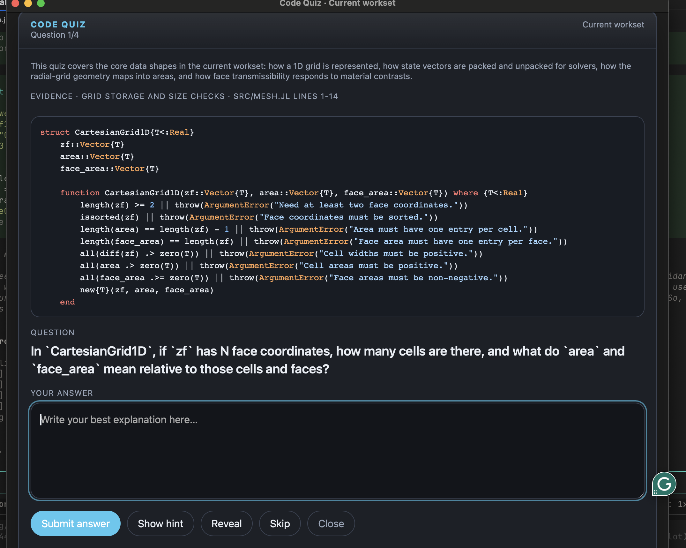

# pi-code-quiz

Active code-reading quiz for [pi](https://github.com/badlogic/pi-mono).

Instead of summarizing code for you, `pi-code-quiz` shows a real snippet, asks a question, lets you answer in your own words, gives feedback, and lets you discuss that question further.

## Screenshot



## What it does

- Opens a Glimpse quiz window on macOS with a code snippet, question, and answer box
- Builds quizzes from the current `workset` (inferred active files), `session`, `repo`, or a specific file
- Uses pi's active model; thinking level defaults to current but can be set
- Keeps questions anchored to visible code snippets
- Gives short feedback plus an ideal answer after you submit
- Lets you open a per-question **Discuss further** thread
- Supports audience profiles: `general`, `scientist`, and `developer`

## Commands

| Command | Description |
|---|---|
| `/quiz` | Quiz the current workset (inferred active files) |
| `/quiz workset` | Explicitly quiz the current workset |
| `/quiz session` | Quiz files strongly associated with the current session |
| `/quiz repo` | Quiz repo-level structure and central code |
| `/quiz file <path>` | Quiz a specific file |
| `/quiz <path>` | Shorthand for `/quiz file <path>` when the path exists |
| `/quiz ... --thinking off|minimal|low|medium|high|xhigh` | Override the model thinking level |
| `/quiz ... --audience general|scientist|developer` | Bias the question style for a particular audience |
| `/quiz ... --mode gen|sci|dev` | Short alias for `--audience` |
| `/quiz-close` | Close the active quiz window |

## Audience profiles

- `general` / `gen` — balanced, accessible questions mixing concept and code mechanics
- `scientist` / `sci` — focuses on quantities, state representations, transformations, assumptions, perturbations, and intuitive meaning
- `developer` / `dev` — focuses on interfaces, control flow, contracts, extension points, and debugging/refactoring consequences

`scientist` mode is meant to push the quiz away from software-trivia or pure contract-checking and toward the meaning of the model and what the code is representing.

## Install

From GitHub:

```bash
pi install https://github.com/omaclaren/pi-code-quiz
```

From npm:

```bash
pi install npm:pi-code-quiz
```

Try it without installing:

```bash
pi -e https://github.com/omaclaren/pi-code-quiz
```

After installing, reload or restart pi.

## Notes

- `pi-code-quiz` is for **active recall and code understanding**, not passive summaries.
- Questions are intended to be answerable from the snippet shown in the quiz window.
- After feedback is shown, you can open a short **Discuss further** thread for that card.
- After a set is finished, you can generate more questions from the same scope.
- Quiz packets and quiz runs are stored as hidden session entries.
- The current UI uses a Glimpse window on macOS.

## License

MIT
